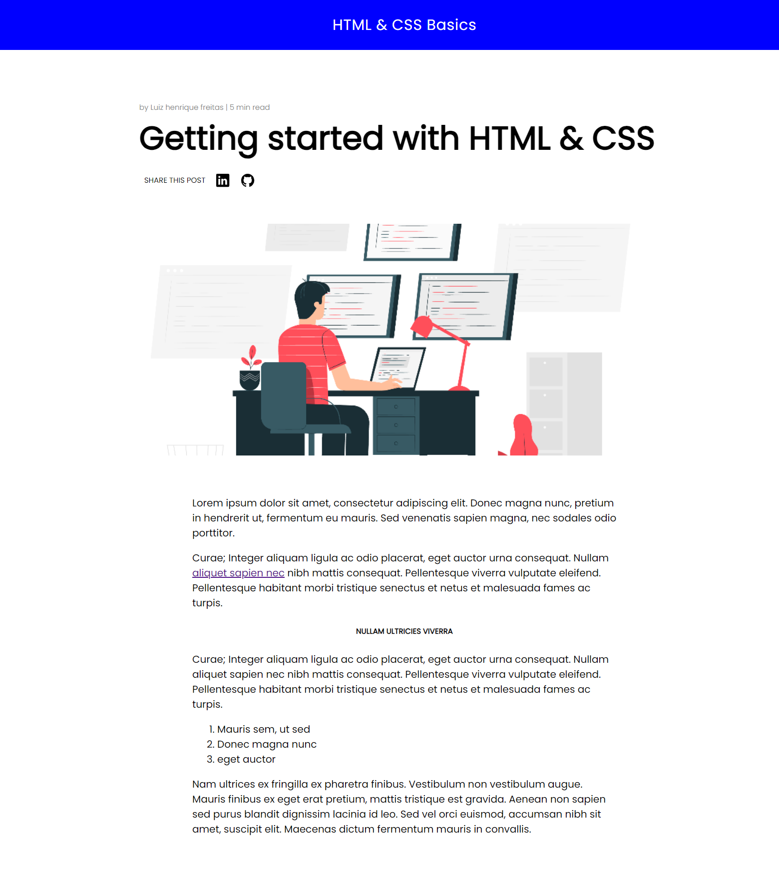

<h1 align="center"> Blog Post </h1>

Página simples que utilizei para aprimorar meus conhecimentos básicos de HTML e CSS.  

  <a href="#-tecnologias">Tecnologias</a>&nbsp;&nbsp;&nbsp;|&nbsp;&nbsp;&nbsp;
  <a href="#-layout">Layout</a>&nbsp;&nbsp;&nbsp;|&nbsp;&nbsp;&nbsp;

 

  

## 🚀 Tecnologias

Esse projeto foi desenvolvido com as seguintes tecnologias:

- HTML e CSS
- Git e Github
- Figma

- [Acesse o projeto finalizado, online](https://luizfreitasdev.github.io/Projeto-LinkTree/)

<!-- ## 🔖 Layout

Você pode visualizar o layout do projeto através [DESSE LINK](https://www.figma.com/community/file/1187422022288947321). É necessário ter conta no [Figma](https://figma.com) para acessá-lo. **

-->
